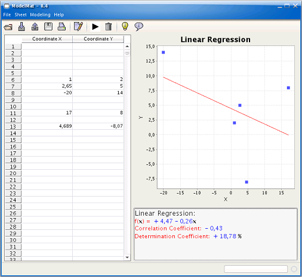
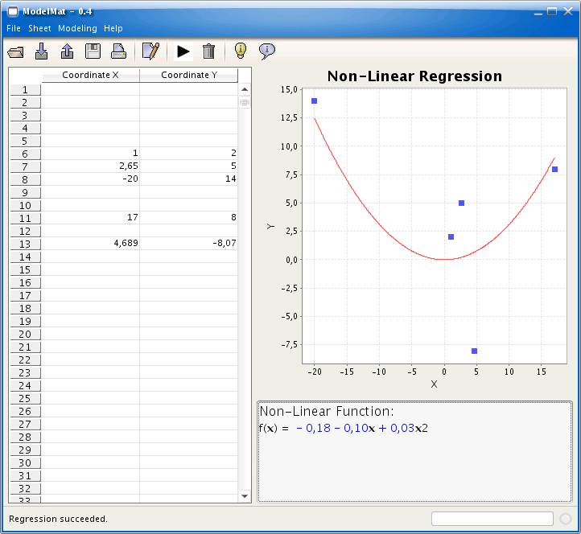

## An Example of Use

A company could use Pteco to try to find some relation between a product’s price and its market-share. 
The relationship between this two variables could indicate that sales increase when the product’s price decreases and vice-versa, providing valuable information to define the company’s marketing strategy.

## Linear Regression 
 

## Non-Linear Regression 

 

You can read more about it [here](https://rafaelfiume.com/2007/05/20/modelmat/).